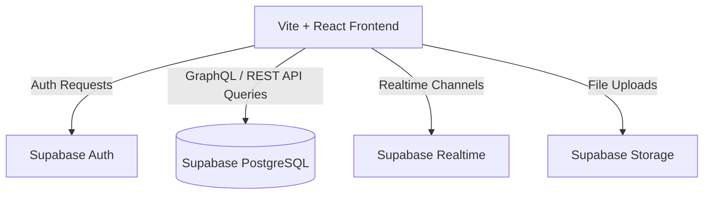

Before writing code for the sandbox application, you must understand its architectural layout and tech stack. This guide explains how our Intern Management System sandbox is designed.

---

## 🎯 Step Objectives
*   Understand the roles of Vite and React in the frontend.
*   Understand how Supabase (PostgreSQL, Auth, Realtime) serves as the backend database.
*   Understand how client and server components communicate.

---

## 📖 Architecture Design

The sandbox application is built using a modern, serverless-first architecture:

### 1. The Frontend (Vite + React)
*   **Vite:** Serves as our lightning-fast asset bundler and dev server.
*   **React:** Provides our interactive, component-based user interface.
*   **Aesthetics:** Follows our glassmorphic design token guidelines (curated HSL palettes, blur backdrops, glow indicators) defined in [DESIGN.md](/design).

### 2. The Backend (Supabase)
Supabase provides our backend services without the need to write custom server APIs:
*   **PostgreSQL Database:** Storing all application records (intern profiles, tasks list, mentor logs).
*   **Authentication (Auth):** Handles user sign-ups, magic links, passwords, and session tokens.
*   **Realtime:** Automatically broadcasts database changes (e.g. when an intern updates a task, other mentors see the change immediately).
*   **Storage:** Manages file storage, such as uploading profile pictures or candidate resumes.

### 3. Connection & Environment Configuration
Vite communicates with Supabase via the `@supabase/supabase-js` client SDK. It uses environment variables (typically `VITE_SUPABASE_URL` and `VITE_SUPABASE_ANON_KEY`) loaded from a `.env` file to configure connection states.
