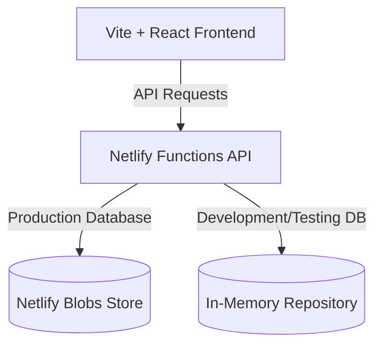

Before writing code for the sandbox application, you must understand its architectural layout and tech stack. This guide explains how our Intern Management System sandbox is designed.

---

## 🎯 Step Objectives
*   Understand the roles of Vite and React in the frontend.
*   Understand how Netlify Functions provide serverless backend endpoints.
*   Understand the database repository pattern using Netlify Blobs (production) and In-Memory storage (local development/testing).

---

## 📖 Architecture Design

The sandbox application (**Fellowship Management System**) is built using a serverless-first architecture:

### 1. The Frontend (Vite + React)
*   **Vite:** Serves as our lightning-fast asset bundler and dev server.
*   **React:** Provides our interactive, component-based user interface.
*   **Aesthetics:** Follows our Astro Starlight design guidelines (matching HSL gray shades, hairline borders, and default tags/buttons).

### 2. The Backend (Netlify Functions)
Serverless API endpoints are deployed to serve API endpoints:
*   **`netlify/functions/api.js`**: An ES Module serverless router handling candidate registration, progress logging, and graduation certificate generation.

### 3. Database Repositories
We use the Repository Pattern to abstract data persistence:
*   **Production (Netlify Blobs):** A serverless key-value blob storage provided by Netlify, requiring zero configuration or credentials.
*   **Local Development (In-Memory Repository):** A fallback data store seeded with mock candidates, allowing you to develop and test locally with no database setups.

---
## ✅ Step 6 Progress Checkpoint

In this step, you can complete at least:

* *1 pull request*
* *1 valid issue*
* *1 constructive peer-review comment*

Approved contributions will count toward your final merit score.

